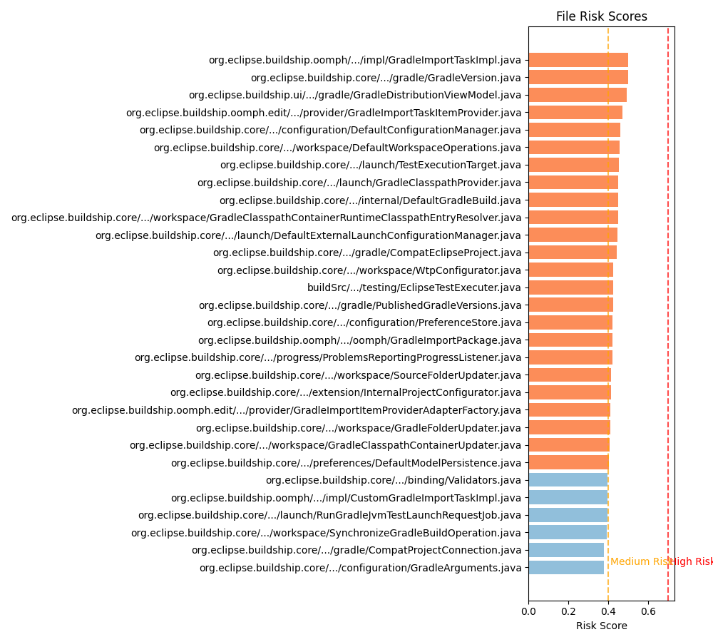

# Repository Comparison Analysis Results

## Introduction

This document presents a comparative analysis of three repositories (Buildship, OpenJ9, and OpenJDK) using the REPD (Repository Engineering and Project Dynamics) model. The analysis evaluates code quality, architecture, and risk factors across these codebases to identify patterns, potential issues, and areas for improvement.

## Methodology

The analysis was conducted using the REPD model, which examines several key aspects of software repositories:

- **Structure Analysis**: Maps dependency relationships between files
- **Risk Assessment**: Calculates risk scores based on complexity, churn, coupling, structural importance, and age
- **Entry Point Detection**: Identifies interface files and main execution entry points
- **Change Coupling Analysis**: Detects files that frequently change together

Each repository was analyzed using consistent parameters:
- Maximum 500 files analyzed
- 90 days of commit history considered
- Risk factor weights: complexity (0.25), churn (0.25), coupling (0.2), structural (0.2), age (0.1)

## Comparative Overview

| Metric | Buildship | OpenJ9 | OpenJDK |
|--------|-----------|--------|---------|
| Total Files Analyzed | 500 | 500 | 500 |
| Dependencies | 81 | 199 | 238 |
| High Risk Files | 0 | 0 | 0 |
| Medium Risk Files | 24 (4.8%) | 62 (12.4%) | 103 (20.6%) |
| Low Risk Files | 657* | 7989* | 58707* |

*Note: The total number of low-risk files reported is higher than analyzed files (500) because the reports include all repository files, not just those selected for detailed analysis.

## Risk Distribution Comparison

The repositories demonstrate different risk profiles:

- **Buildship** shows concentrated risk in UI components and core Gradle integration functionality, with coupling being the primary risk factor.
- **OpenJ9** exhibits focused risk in debugging tools and core readers, with complexity being the primary risk factor.
- **OpenJDK** demonstrates distributed risk across demo components and build tools, with complexity being the primary risk factor.

## Architecture and Dependency Analysis

### Structural Comparison

The dependency structure analysis reveals distinct architectural patterns:

- **Buildship**: Exhibits a plugin architecture with clear Eclipse integration points. Has the lowest dependency count (81), indicating a more modular design.
- **OpenJ9**: Shows a JVM implementation architecture with specialized components for debugging and core VM operations. Has moderate dependency count (199).
- **OpenJDK**: Displays a complex, highly interconnected architecture with the highest dependency count (238), suggesting tighter coupling between components.

### Central Components

Key central files in each repository:

**Buildship**:
- `org.eclipse.buildship.core/src/main/java/org/eclipse/buildship/core/internal/event/Event.java` (Centrality: 0.01)
- `org.eclipse.buildship.core/src/main/java/org/eclipse/buildship/core/internal/configuration/Test.java` (Centrality: 0.01)
- `org.eclipse.buildship.core/src/main/java/org/eclipse/buildship/core/internal/workspace/BaseProjectChangedEvent.java` (Centrality: 0.01)

**OpenJ9**:
- `debugtools/DDR_VM/src/com/ibm/j9ddr/corereaders/macho/LoadCommand.java` (Centrality: 0.02)
- `debugtools/DDR_VM/src/com/ibm/j9ddr/tools/ddrinteractive/Command.java` (Centrality: 0.01)
- `debugtools/DDR_VM/src/com/ibm/j9ddr/corereaders/elf/ELFDumpReader.java` (Centrality: 0.01)

**OpenJDK**:
- `src/demo/share/jfc/J2Ddemo/java2d/Surface.java` (Centrality: 0.02)
- `make/jdk/src/classes/build/tools/jdwpgen/AbstractSimpleTypeNode.java` (Centrality: 0.01)
- `src/demo/share/jfc/SwingSet2/DemoModule.java` (Centrality: 0.01)

## Change Coupling Patterns

The change coupling analysis did not reveal significant high-coupling patterns in the analyzed time period (90 days) for any of the three repositories. This could indicate:

1. Strong modularity in the codebases
2. Limited development activity in the analyzed period
3. Well-structured changes that affect focused parts of the system

## Risk Hotspots

### Critical Hotspots Comparison

The most critical hotspots in each repository:

**Buildship**:
1. `org.eclipse.buildship.oomph/src/main/java-generated/org/eclipse/buildship/oomph/impl/GradleImportTaskImpl.java` (Risk: 0.50) - Complexity in import task implementation
2. `org.eclipse.buildship.core/src/main/java/org/eclipse/buildship/core/internal/util/gradle/GradleVersion.java` (Risk: 0.50) - Version handling complexity
3. `org.eclipse.buildship.ui/src/main/java/org/eclipse/buildship/ui/internal/util/gradle/GradleDistributionViewModel.java` (Risk: 0.49) - Coupling in UI components

**OpenJ9**:
1. `debugtools/DDR_VM/src/com/ibm/j9ddr/corereaders/elf/ELFDumpReader.java` (Risk: 0.50) - High complexity in dump processing
2. `debugtools/DDR_VM/src/com/ibm/j9ddr/corereaders/memory/AbstractMemory.java` (Risk: 0.50) - Core memory handling complexity
3. `debugtools/DDR_VM/src/com/ibm/j9ddr/vm29/j9/HashTable_V1.java` (Risk: 0.50) - Data structure implementation complexity

**OpenJDK**:
1. `src/demo/share/jfc/J2Ddemo/java2d/Surface.java` (Risk: 0.50) - UI rendering complexity
2. `src/demo/share/java2d/J2DBench/src/j2dbench/Option.java` (Risk: 0.50) - Options handling complexity
3. `src/demo/share/java2d/J2DBench/src/j2dbench/tests/text/TextTests.java` (Risk: 0.50) - Testing framework complexity

### Primary Risk Factors

The dominant risk factors identified in each repository:

**Buildship**: Primary risk stems from **coupling** between components, particularly in core configuration and UI components (16 of 20 top risk files)

**OpenJ9**: Primary risk stems from **complexity** in debugging and memory management components (all top risk files)

**OpenJDK**: Primary risk stems from **complexity** in demo applications and build tools (all top risk files)

## Entry Points Analysis

### Key Entry Points

**Buildship**:
- `org.eclipse.buildship.gradleprop.ls/src/main/java/org/eclipse/buildship/gradleprop/ls/GradlePropertiesLanguageServerLauncher.java` (Confidence: 0.75)
- `.github/scripts/generate_eclipse_versions.py` (Confidence: 0.70)

**OpenJ9**:
- `debugtools/DDR_Autoblob/src/com/ibm/j9ddr/autoblob/GenerateBlobC.java` (Confidence: 0.71)
- `debugtools/DDR_VM/src/com/ibm/j9ddr/tools/ddrinteractive/DDRInteractive.java` (Confidence: 0.71)
- Multiple utility classes in the debugging tools (Confidence: 0.71)

**OpenJDK**:
- `make/langtools/tools/javacserver/Main.java` (Confidence: 0.86)
- `make/jdk/src/classes/build/tools/charsetmapping/Main.java` (Confidence: 0.86)
- `make/jdk/src/classes/build/tools/fixuppandoc/Main.java` (Confidence: 0.86)
- `make/jdk/src/classes/build/tools/jdwpgen/Main.java` (Confidence: 0.86)

## Cross-Repository Observations

Based on the REPD analysis, the following patterns emerge across repositories:

1. **Architecture Differences**: 
   - Buildship shows the most modular architecture with the lowest dependency count
   - OpenJDK shows the highest interconnectivity between components
   - OpenJ9 falls in the middle in terms of architectural coupling

2. **Risk Distribution**: 
   - All three repositories show moderate risk profiles with no high-risk files
   - OpenJDK has the highest percentage of medium-risk files (20.6%)
   - Buildship has the lowest percentage of medium-risk files (4.8%)

3. **Code Quality Indicators**: 
   - Buildship's primary risk factor is coupling, suggesting potential architectural refactoring needs
   - OpenJ9 and OpenJDK's primary risk factor is complexity, indicating intricate algorithmic implementations
   - All repositories show a relatively healthy distribution of risk

4. **Entry Points Pattern**:
   - OpenJDK has the most clearly defined entry points (highest confidence scores)
   - Buildship has fewer identified entry points, suggesting more distributed functionality
   - OpenJ9's entry points are concentrated in debugging tools

## Conclusions and Recommendations

### Key Findings

1. **Buildship** shows a well-modularized architecture with low dependency count, but coupling between components is the primary risk factor.
   - The core configuration and UI components show the highest coupling, suggesting potential architectural dependencies that could be refactored.

2. **OpenJ9** demonstrates a specialized focus on VM debugging tools with complexity as the main risk factor.
   - The debugging tools (DDR_VM components) contain the most complex code, which is expected given their intricate functionality.

3. **OpenJDK** exhibits the highest interconnectivity and the highest percentage of medium-risk files.
   - Interestingly, many of the highest risk components are in demo applications rather than core JDK functionality.

### Recommendations

Based on the comparative analysis, we recommend:

1. **For Buildship**:
   - Review and potentially refactor the coupling between UI components and core functionality
   - Consider implementing more automated tests for the identified medium-risk files
   - Review the GradleImportTaskImpl implementation for potential simplification

2. **For OpenJ9**:
   - Add additional documentation and unit tests for the complex debugging components
   - Consider modularizing the DDR_VM components further to reduce complexity
   - Review memory handling in AbstractMemory.java for optimization opportunities

3. **For OpenJDK**:
   - Evaluate whether the complexity in demo applications is necessary or could be simplified
   - Review build tool complexity in the make/ directory
   - Consider more fine-grained modularization to reduce the high dependency count

## Future Analysis

To improve these findings:

1. **Deeper Historical Analysis**: Extend the analysis to include more than 90 days of history for better churn and coupling detection
2. **Complete Codebase Analysis**: Analyze more than 500 files to get a complete picture of each repository
3. **Language-Specific Metrics**: Include language-specific complexity metrics for Java and C/C++
4. **Performance Correlation**: Correlate identified risk hotspots with actual performance issues or bug reports

---

